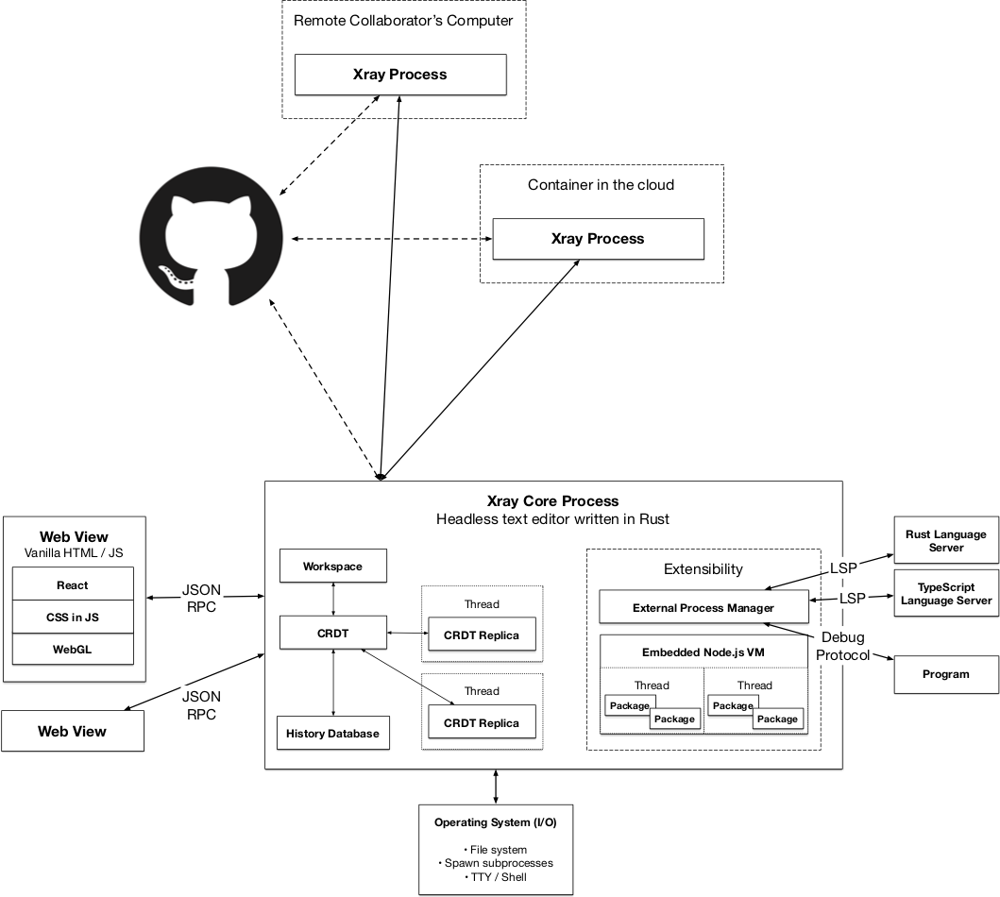

# Update for March 5, 2018

## Contributions

We got some help from [@apcragg](https://github.com/apcragg), who made [the build script for our N-API bindings support Linux and Windows](https://github.com/atom/xray/pull/25). Also [@maxim-lian](https://github.com/maxim-lian) helped by updating our repo to correctly use [Cargo workspaces](https://github.com/atom/xray/pull/26). Also saw a bunch of people building the project and exploring. There's not much to see yet, but we're happy that people are interested.

## Hacker News and new contributor interest

Someone posted this repo to Hacker News last week, which drew a bunch of attention to the project. Overall this is obviously great, but I sort of regret reading the comments. People can be so mean on HN and it's really a drag to feel like you're the target of vitriol and derision. I'm just over here trying to build stuff. But I guess you gotta just have a thick skin and keep coding.

Thanks to everyone who jumped in with an interest in contributing! The engagement was really helpful and prompted me to post [the beginnings of a contributing guide](https://github.com/atom/xray/blob/master/CONTRIBUTING.md) and some initial [help-wanted issues](https://github.com/atom/xray/labels/help%20wanted). Looking forward to engaging with someone who wants to dive in on one of those problems.

## Progress on selections

We have selections and cursors rendering on a branch, and hope to merge it this week. The results are promising, and we're only exceeding our 8 ms frame budget when we reach thousands of selections in a document with thousands of edits. We think we can do better with some optimizations.

## Big architectural changes incoming

A conversation with [@joefitzgerald](https://github.com/joefitzgerald) at Pivotal in Denver led to a big shift in how we plan to interoperate between JavaScript and Rust. Originally, we planned to embed a shared library written in Rust into the Electron render process and use Node's N-API to interoperate. Somewhere along the line, we realized that to maintain a global edit history for all files that wasn't tied to a project, we would need to unify all of the file system interaction in a single process to avoid race conditions between multiple Electron windows. This process gradually grew in our thinking to take on other responsibilities, such as connecting to other processes to facilitate real time collaboration. Eventually, we decided that we would need to route all I/O through this central process.

Joe asked a simple and insightful question. If we're planning to route all I/O through an external process, then what's the point of the Node APIs available in Electron? They're all designed around I/O, but we won't be doing any. This made it click for me that we should actually move *all* of the application logic completely into the external Rust process and treat the UI as an extremely thin layer that interacts with the app via an async channel. We'll use something akin to the Flux architecture, where the UI can submit actions to the server on the channel and receive JSON payloads representing state to render. Yes, I realize that this makes us even *more* similar to Xi architecturally.

This will make the UI code 100% ordinary HTML and JavaScript with no assumption of any special APIs, which really supports our goal of running on the web. For the desktop experience, we can use any solution that gives us a modern, standards-compliant web view and run the core of the application as a server process. The easiest solution on the desktop would be Electron, but we could even use an embedded WebKit view on the Mac to save on bundle size if we wanted to absorb that complexity (it's not clear it's worth it though). On the web, we'll need the server process to run inside the browser, because this whole design assumes an ultra-low-latency connection between the front end and the back end. In this scenario, we can compile some subset of the server process that runs on the desktop to WebAssembly and run it in a worker thread. This web "back end" can then establish a peer-to-peer connection with another Xray process running in the cloud or on another user's computer. This will provide a 100% compatible experience between the browser and the desktop and enable collaboration between users in either environment.

Here's a somewhat complicated picture of our current thinking. Note the centrality of the "Xray Core Process". All the logic and extensibility lives there, and the view becomes much simpler.

We'll be starting on these changes this week. The first step is to completely eliminate Electron and wrap `xray_core` in a server process, which we're thinking about calling `xray_server`. The front end will be `xray_client` and compile down to a simple HTML file. When you open it in the browser, it will connect to a local port based on the query parameter in the URL.

Once we accomplish that, we'll need to figure out an alternate variant of the server, maybe called `xray_server_wasm`, which runs a "server" in one or more worker threads for a low-latency experience on the web. Compiling pure Rust to WebAssembly hopefully won't be a big deal, but we are a bit worried about including TreeSitter, whose runtime and grammars are written in C. We think we can figure it out though.